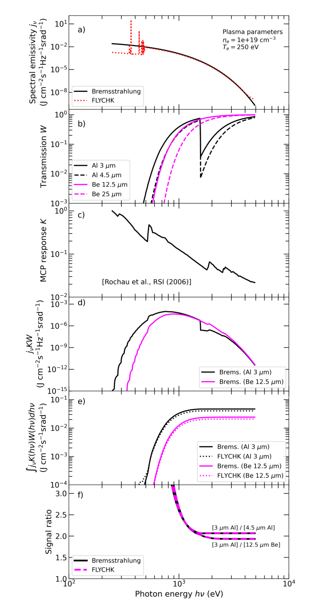
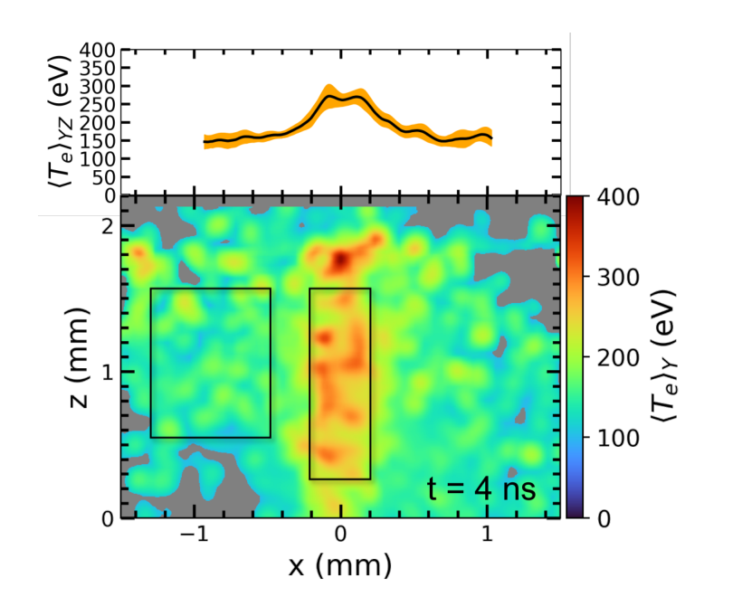

# HIPPIE

<p align="center">
  <strong> HIPPIE (pinHole Imaging PiPelInE) is comapnion software for the gated pinhole imaging technique developed for HEDP experiments by Shaeffer et al. </strong>
</p>

<p align="center">
  A MATLAB-reference and Python analysis package for differential-filter x-ray
  pinhole thermometry in high-energy-density plasma experiments.
</p>

HIPPIE grew out of our SULI and PPPL magnetic-reconnection work. We have
reorganized the historical analysis into a public Python package while keeping
the MATLAB programs that document how the diagnostic developed. The result is a
set of small, explicit stages for reading gated x-ray images, preparing and
aligning paired pinholes, modeling their filter response, and inferring electron
temperature.

## Install Python or explore the MATLAB reference

For the Python package, clone the repository and install it in editable mode:

```bash
git clone https://github.com/jmmolina113/HIPPIE.git
cd HIPPIE
python -m pip install -e .
```

HIPPIE requires Python 3.10 or newer and uses NumPy, SciPy, h5py, pandas, and
Matplotlib. The preserved MATLAB generations are under
[`matlab/reference/`](matlab/reference/); they can be read or run independently
of the Python package when the corresponding experimental inputs are available.

## Reference analysis and current package

The MATLAB source remains our reference for the original shot-analysis
workflow. The Python package implements the same basic scientific stages through
a portable API:

- HDF5 dataset discovery and image loading;
- shot and calibration configuration;
- background subtraction, flat-fielding, and signal flooring;
- smoothing, spatial binning, and image registration;
- filter-stack transmission and detector-response interpolation;
- bremsstrahlung ratio curves and temperature inversion;
- run manifests, saved temperature products, lineouts, and regional summaries.

The automated tests exercise these individual stages and several cross-stage
paths. The remaining scientific comparison is the shot-specific MATLAB/Python
golden case. We have identified N210317-002 with N180916-003 calibration for
that comparison, but the raw HDF5 and calibration data are not distributed in
this repository.

## Run HIPPIE in sixty seconds

Install the test tools and run the public suite:

```bash
python -m pip install pytest
pytest -q
```

Inspect the numerical datasets in an authorized HDF5 file:

```bash
hippie-datasets path/to/shot.h5
```

Then load a case definition and work with the numerical stages directly:

```python
import numpy as np

from hippie import load_case_config, ratio_curve, invert_ratio

case = load_case_config("config/golden_case_n210317_002.json")

energy_eV = np.linspace(100.0, 10_000.0, 2000)
temperatures_eV = np.geomspace(*case.temperature_bounds_eV, 500)

modeled_ratio = ratio_curve(
    energy_eV,
    temperatures_eV,
    transmission_1,
    transmission_2,
    detector_response,
)
temperature_map_eV = invert_ratio(
    measured_ratio,
    temperatures_eV,
    modeled_ratio,
)
```

Here `transmission_1`, `transmission_2`, `detector_response`, and
`measured_ratio` are arrays prepared from the calibration and registered image
pair for the shot being analyzed.

## Configure an analysis

The configuration file records the shot, calibration, pinhole pair, image
processing choices, and temperature range without embedding private data in the
repository:

```python
from hippie import load_case_config

case = load_case_config("config/golden_case_n210317_002.json")
print(case.name)
print(case.pinhole)
print(case.temperature_bounds_eV)
```

Data paths may use `HIPPIE_DATA_ROOT` so the same configuration can be shared
without assuming a particular workstation or filesystem layout.

## How the diagnostic works

### Differential-filter measurement

The diagnostic records plasma self-emission through neighboring pinholes with
different filter stacks. Because the channels view the same source with the same
gated detector, their relative attenuation carries temperature information.

For an optically thin, approximately Maxwellian plasma, we use the continuum
shape

$$
j(E,T_e) \mathrel{\propto} T_e^{-1/2}
\exp\left(-\frac{E}{T_e}\right),
$$

with photon energy $E$ and electron temperature $T_e$ in the same energy units.
For filter channel $i$, the model signal is

$$
I_i(T_e) = \int j(E,T_e)K(E)W_i(E)\,\mathrm{d}E,
$$

where $K(E)$ is the detector response and $W_i(E)$ is the transmission of the
filter stack. HIPPIE multiplies component transmission curves, places the
detector response on the working energy grid, and evaluates this integral
numerically. The theoretical observable is

$$
R(T_e) = \frac{I_1(T_e)}{I_2(T_e)}.
$$

Density, collection geometry, and absolute normalization cancel when they are
common to both matched views. This is the central advantage of the diagnostic:
temperature can be inferred from relative spectral attenuation without an
absolute measurement of the x-ray brightness.

<p align="center">
  
</p>

<p align="center"><em>
  The published HIPPIE response calculation, showing how emissivity, filter
  transmission, and detector response combine into a temperature-dependent
  signal ratio. Figure 11 of Valenzuela-Villaseca et al. (2024).
</em></p>

### Image preparation and inversion

Before taking a ratio, we prepare each detector image as

$$
N_i(x,y) = \max\left(
\frac{D_i(x,y)-B_i(x,y)}{F_i(x,y)},N_{\min}
\right),
$$

where $D_i$ is the raw image, $B_i$ is the background, $F_i$ is the flat-field,
and $N_{\min}$ is a chosen floor. The two pinhole images are then aligned so
that their pixels represent the same source coordinates. Their measured ratio
is

$$
S(x,y) = \frac{N_1(x,y)}{N_2(x,y)}.
$$

HIPPIE evaluates $R(T_e)$ on a strictly increasing temperature grid and assigns
each valid pixel the grid temperature whose modeled ratio is nearest to
$S(x,y)$. This produces a two-dimensional, line-of-sight-averaged electron-
temperature map.

<p align="center">
  
</p>

<p align="center"><em>
  A published HIPPIE temperature map of the interacting plumes and current
  sheet at 4 ns. Figure 3 of Valenzuela-Villaseca et al. (2024).
</em></p>

### Registration, sensitivity, and interpretation

Registration is important because a small displacement across a target edge,
plume, or current sheet can create a ratio gradient unrelated to temperature.
The Python registration routine returns the recovered integer shift and a
normalized cross-correlation score so that the alignment can be inspected with
the result.

Temperature sensitivity depends on the slope of $R(T_e)$. Where the curve is
flat, a small ratio change corresponds to a broad temperature interval. Filter
selection therefore balances spectral contrast against photon statistics:
similar filters provide little contrast, while an overly attenuating channel
can approach the detector background.

The single-temperature interpretation also assumes that the source is optically
thin, adequately described by the chosen continuum model, and not dominated by
unresolved line emission or strong temperature variation along the line of
sight. When these assumptions are imperfect, the result is best interpreted as
a ratio-weighted effective temperature rather than a unique local temperature.

The derivation and its experimental context are discussed further in
[`docs/THEORY_AND_ALGORITHMS.md`](docs/THEORY_AND_ALGORITHMS.md) and
[`docs/THEORY_BACKGROUND_SCHAEFFER2021.md`](docs/THEORY_BACKGROUND_SCHAEFFER2021.md).
Our recovered SULI final report adds the first-party experimental narrative,
original lineout algorithm, and filter/alignment/noise sensitivity construction
in [`docs/SULI_2021_REPORT.md`](docs/SULI_2021_REPORT.md).

## Analyze and save a result

The low-level API keeps image processing and post-analysis separate:

```python
from hippie import (
    RunManifest,
    TemperatureResult,
    calibrate_image,
    register_by_cross_correlation,
    summarize_region,
)

prepared = calibrate_image(raw, background, flatfield, floor=1.0)
registration = register_by_cross_correlation(reference, moving)
summary = summarize_region(temperature_map_eV, region_mask)
```

`TemperatureResult.save()` writes the numerical arrays and a JSON manifest to a
new output directory. Source HDF5 files are opened for reading and are not
overwritten by these stages.

## What is included

| Path | Purpose |
|---|---|
| [`src/hippie/`](src/hippie/) | Python package and processing stages |
| [`tests/`](tests/) | Configuration, numerical-stage, and post-analysis tests |
| [`config/`](config/) | Portable case definitions |
| [`matlab/reference/`](matlab/reference/) | SULI 2021, PPPL 2022, and Spring 2023 MATLAB lineage |
| [`legacy/python_notebooks/`](legacy/python_notebooks/) | Earlier PlasmaPy notebooks |
| [`docs/`](docs/) | Theory, architecture, sources, and user documentation |
| [`assets/publications/`](assets/publications/) | Project-related publication figures used here |

## Numerical and output conventions

The processing functions operate on NumPy arrays and require paired images to
have compatible dimensions. Temperature inversion uses a caller-supplied,
strictly increasing grid and returns `NaN` where no finite comparison can be
made. Result manifests can record the source shot, selected dataset, software
version, processing mode, alignment, and numerical settings.

The raw experimental archive remains separate from this public repository. It
contains the inputs needed for shot-level comparison, while this repository
contains the software, portable configuration, and historical implementations.

## Validate your checkout

Run:

```bash
python -m compileall -q src
pytest -q
```

The current suite covers configuration loading, calibration and flooring,
temperature-grid inversion, binning, filter stacks, image registration,
manifests, lineouts, and regional summaries. Golden-case tests will compare the
Python and MATLAB paths once the corresponding experimental inputs can be used
in a reproducible run.

## Documentation

- [Documentation and sources](docs/SOURCES.md)
- [User guide](docs/USER_GUIDE.md)
- [Theory and algorithms](docs/THEORY_AND_ALGORITHMS.md)
- [Diagnostic theory background](docs/THEORY_BACKGROUND_SCHAEFFER2021.md)
- [Published HIPPIE application](docs/PUBLISHED_APPLICATION_VALENZUELA_VILLASECA2024.md)
- [Architecture](docs/ARCHITECTURE.md)
- [Output and testing](docs/OUTPUT_AND_TESTING.md)
- [Historical reconstruction](docs/HIPPIE_ARCHAEOLOGY.md)

## Publications

- D. B. Schaeffer *et al.*, “Measurements of Electron Temperature in
  High-Energy-Density Plasmas using Gated X-Ray Pinhole Imaging,” *Review of
  Scientific Instruments* **92**, 043524 (2021),
  [doi:10.1063/5.0043833](https://doi.org/10.1063/5.0043833).
- V. Valenzuela-Villaseca *et al.*, “X-ray imaging and electron temperature
  evolution in laser-driven magnetic reconnection experiments at the National
  Ignition Facility,” *Physics of Plasmas* **31**, 082106 (2024),
  [doi:10.1063/5.0213598](https://doi.org/10.1063/5.0213598),
  [arXiv:2404.07799](https://arxiv.org/abs/2404.07799).

The figures above are reproduced from the project-related 2024 article. The
article is published under a Creative Commons Attribution 4.0 license.

## License

HIPPIE is released under the [Apache License 2.0](LICENSE).
